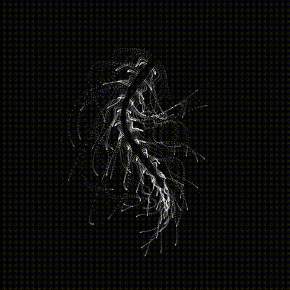

(English)[README.md] | (简体中文)[README.zh.md]

# Virtual Digital Life

Digital life simulated by mathematical functions

## ✨ Raise a Digital Life on Your Desktop



## 🚀 Quick Start

### Installation

1. Download the latest version from the [releases page](https://github.com/ystemsrx/Digital-Life/releases)
2. Extract the files to your desired location
3. Run `pet.exe` to start the application
4. Right-click the system tray icon to access settings

### Build from Source

```bash
git clone https://github.com/yourusername/desktop-pet-fish.git
cd desktop-pet-fish
dotnet build
dotnet run
```

## ⚙️ Configuration

Right-click the system tray icon and select "Settings" to access the settings window.

### Available Settings

| Setting | Description | Range |
|---------|-------------|-------|
| **Pet Speed** | Movement speed | 0.1 - 2.0 |
| **Rotation Speed** | Speed of direction changes | 0.001 - 0.01 |
| **Wander Strength** | Randomness of movement pattern | 0.01 - 0.2 |
| **Wall Repulsion** | Force pushing away from screen edges | 100 - 5000 |
| **Visual Quality** | Number of particles rendered | 1000 - 10000 |
| **Frame Rate** | Animation smoothness (FPS) | 30 - 120 |
| **Transparency** | Transparency level | 0.1 - 1.0 |
| **Color** | Color customization | RGB color picker |

## 🎮 Usage

- **Launch**: Run the application - it will appear on top of your desktop without interfering with mouse operations
- **Settings**: Right-click system tray icon → "Settings"
- **Exit**: Right-click system tray icon → "Exit"
- **Auto-start**: Enable startup with Windows in settings

## 🛠️ Technical Details

- **Framework**: WPF (.NET 8.0)
- **Rendering**: High-performance graphics rendering using WriteableBitmap
- **Architecture**: MVVM pattern with settings persistence support
- **Dependencies**:
  - Extended.Wpf.Toolkit
  - Newtonsoft.Json
  - System.Drawing.Common

## 📁 Project Structure

```
pet/
├── MainWindow.xaml(.cs)     # Main application window and fish logic
├── SettingsWindow.xaml(.cs) # Configuration interface
├── SettingsManager.cs       # Settings persistence and management
├── App.xaml(.cs)           # Application entry point
└── pet.csproj              # Project configuration
```

## 🤝 Contributing

Contributions are welcome! Feel free to submit Pull Requests.

## 📝 License

This project is licensed under the MIT License - see the [LICENSE](LICENSE) file for details.

## 🐛 Known Issues

- High particle counts may affect performance on older systems

---

**Enjoy your new desktop companion!